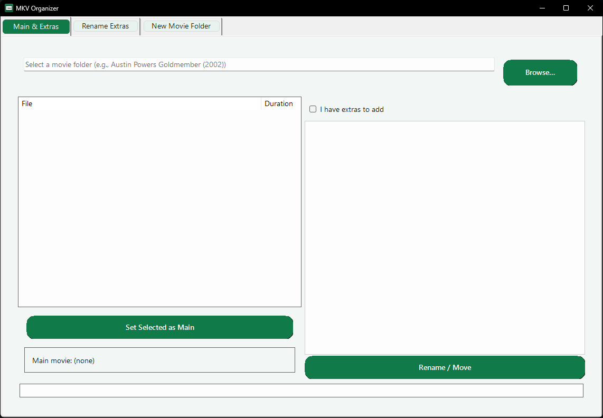
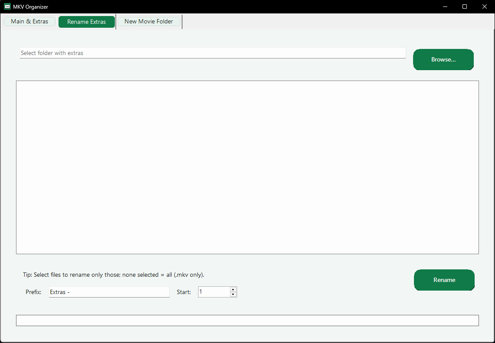
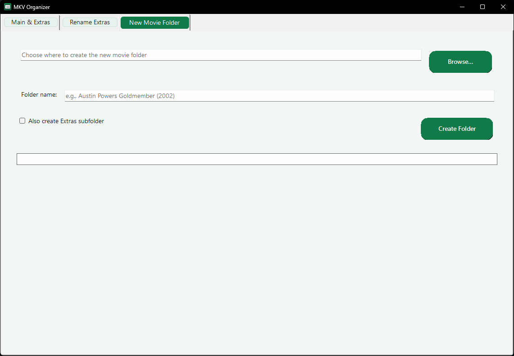

# MKV Renamer

A fast, friendly Windows app for organizing movie folders:

- Rename the **main movie** to match its folder (e.g., `Austin Powers Goldmember (2002).mkv`)
- Move selected files into an **Extras** subfolder
- Batch-rename extras (`Extras - 01.mkv`, `Extras - 02.mkv`, … or any prefix you choose)
- Create new movie folders (optionally with an `Extras` subfolder)
- Modern, clean UI with a deep-green accent and rounded buttons

> ✅ **Privacy-friendly:** No internet access. The app only reads/writes files you select.

---

## Quick Start

### Main & Extras
1. Click **Browse…** and pick a movie folder (named like `Title (Year)`).
2. Select the movie file, click **Set Selected as Main**.  
   It will be renamed to exactly the same as the folder (plus `.mkv`).
3. *(Optional)* Check **I have extras to add**, pick extra files, then **Rename / Move** to create `Extras` and move them.

### Rename Extras
1. Choose a folder with extra MKVs.
2. *(Optional)* Multi-select files to rename only those; none selected = all.
3. Set your **Prefix** (default `Extras - `) and **Start** number, then click **Rename**.

### New Movie Folder
1. Pick the **parent directory**.
2. Enter **Folder name** (e.g., `Movie Title (2025)`).
3. *(Optional)* Check **Also create Extras subfolder**, then **Create Folder**.

---

## Why it’s Safe

- **No overwrites:** If a destination name already exists, the app auto-appends ` (1)`, ` (2)`, … to keep files safe.
- **Only what you choose:** It touches only files you explicitly select or the `.mkv` files in the chosen folder.
- **No background tasks:** Everything runs when you click the button.

---

## Features

- **Duration column** in the main list to help pick the real movie file
- **Modern UI** (rounded buttons, spacing, clean color palette)
- **Portable** (single folder; no installer required)
- **Windows Shell integration** (uses shell properties for duration)
- **MKV-focused** (keeps the app simple and predictable)

---

## Screenshots

> Add these later in `docs/` and update the paths.

**Main & Extras**  

**Rename Extras**  

**New Movie Folder**  

---

## Known Limitations

- Targets `.mkv` files (by design).
- Duration comes from Windows Shell; some unusual files may show blank.
- Operates on the **selected folder only** (no recursive subfolders).

---
